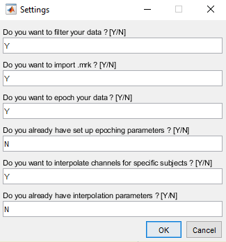

# User Manual

## 1. Filtering_epoching.m

**⚠️ Keep the defaults values if you don't know what you are doing!**

#### 1.1 Settings

With your raw EEG files (.bdf or .set 64 channels only), you will need to:

1) Filter their signals

2) Re-specify their trigger (accept inputs from .mrk files)

3) Epoch them based on your design.

This first prompt allows you to indicate to the script which of these three steps you want to do. Keep in mind that everything is skippable to allow flexibility.

In your first run, you should not have any epoching parameters. These parameters will create themselves after our first epoching.

#### 1.2 Parameters

This second prompt contains all the basic parameters for the steps you choose.
Thus, if you decided to not filter your data on the last prompt, the question of the frequency band pass will not be displayed.

1) For the extension of your data, you may enter a suffix with the extention. Ex: *"Cond1.bdf"*. In this case, only the bdf files finishing by *"Cond1"* will be loaded.

2) After filtering, a filtered .set copy of your files will be saved with this suffix to their name.
With the default value, your filetered files will be named *FileName_filtered.set*.
The same logic is applied for the saved epoched files.

3) The lower and upper thresholds of the epoching interval. With the default values, the epoch will include 100ms pre-stimuli, and 700ms post-stimuli.
**A space needs to be input between the two values.**

4) If there is a trigger delay between the trigger and the real display on the subject screen, you can correct it here.

#### 1.3 Algorithms options

Three external algorithms are implemented in this filtering pipeline in addition to the baseline correction. Links can be found in the Dependencies section of the [README.md](README.md).
CleanLine to efficiently filter and remove sinusoidal noise.
ASR to clean non-sinusoidal high-variance bursts.
BLINKER to detect and reject epochs containing an eye blink during stimulus display.

In case you choose to not filter or epoch during the [settings prompt](#11-settings), this prompt might differ.

#### 1.4 Files path

1) The script will then ask you to select the folder containing all the files you want to load. **It does not matter if this folder contains sub-folders.
It will take that into account and copy the folder-tree when saving the filtered and epoched .set files.**
It will search for the files finishing by what you input in the first line of the [Parameters prompt](#12-parameters).

2) In the same fashion, if you decided to re-specify your triggers based on .mrk files, it will ask you the folder there are in.
**The script will automatically link the .mrk files to their raw counter-part based on their names.
The file names need to be identical. If not, the .mrk files that could not be found by the script will be listed in the log.txt file at the end of processing.**

3) Enter the folder where you want you filtered and epoched file to be saved.
These files will have the same names and sub-folder tree as your raw files, but with the suffix you input during the [Parameters prompt](#12-parameters).

#### 1.5 Subject specific analyses

You can decide to only choose some files to pre-processed. It can be useful if you decide to include one or two participants more after the first analyses, or if you had a problem on one specific file.

If you choose the specific files option, a prompt will be displayed asking you to tick the files you want to run the script on.

