# User Manual

**Table of Contents**
- [1. Filtering_epoching.m](#1-filtering-epochingm)
  * [1.1 Settings](#11-settings)
  * [1.2 Parameters](#12-parameters)
  * [1.3 Algorithms options](#13-algorithms-options)
  * [1.4 Files path](#14-files-path)
  * [1.5 Subject specific analyses](#15-subject-specific-analyses)
  * [1.6 Epoching parameters](#16-epoching-parameters)
  * [1.7 Output files](#17-output-files)
- [2 Comp_ICA.m](#2-comp-icam)
  * [2.1 ICA Decomposition and Algorithms](#21-ica-decomposition-and-algorithms)
  * [2.2 MPICH2](#22-mpich2)
  * [2.3 Loading and Saving Data](#23-loading-and-saving-data)
  * [2.4 Suffixes](#24-suffixes)
  * [2.5 Folders to Include](#25-folders-to-include)
  * [2.6 ICA Computation](#26-ica-computation)
  * [2.7 ICA Rejection](#27-ica-rejection)
    + [2.7.1 All Components](#271-all-components)
    + [2.7.2 Single Component](#272-single-component)
    + [2.7.3 Visualization of Result](#273-visualization-of-result)
    + [2.7.4 Confirm Rejection](#274-confirm-rejection)
  * [2.8 Log File](#28-log-file)
- [3 ERPs.m](#3-erpsm)
  * [3.1 Settings](#31-settings)
  * [3.2 Parameters](#32-parameters)
  * [3.3 Files path](#33-files-path)
  * [3.4 Subject specific analyses](#34-subject-specific-analyses)
  * [3.5 ERPs parameters](#35-erps-parameters)
  * [3.6 Output files](#36-output-files)
  * [3.7 Advice for interpolation](#37-advice-for-interpolation)
  
  
## 1. Filtering_epoching.m

**⚠️ Leave the defaults values if you don't know what you are doing!**

### 1.1 Settings

With your raw EEG files (.bdf or .set 64 channels only), you will be able to:

1) Filter their signals

2) Re-specify their triggers (accept inputs from .mrk files)

3) Epoch them based on your design.


This first prompt allows you to indicate to the script which of these three steps you want to do. \
Keep in mind that everything is skippable to allow flexibility.

In your first run, you should not have any epoching parameters. These parameters will create themselves after our first epoching.


### 1.2 Parameters

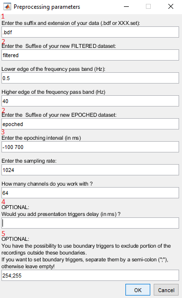

This second prompt contains all the basic parameters for the steps you choose.
Thus, if you decided not to filter your data on the last prompt, the question of the frequency band pass will not be displayed.

1) For the extension of your data, you may enter a suffix. \
Ex: *"Cond1.bdf"*. In this case, only the bdf files finishing by *"Cond1"* will be loaded.

2) After filtering, a filtered .set copy of your files will be saved. \
With the default value, your filetered files will be named *FileName_filtered.set*. \
The same logic is applied for the saved epoched files.

3) The lower and upper thresholds of the epoching interval. \ 
With the default values, the epoch will be restricted from 100ms pre-stimulus to 700ms post-stimulus. \
**A space needs to separate the two values (e.g. [100 700]).**

4) If there is a trigger delay between the trigger data imported from the .mrk file and the real display on the experimental screen, you can adjust it here.


### 1.3 Algorithms options


Three external algorithms are implemented in this filtering pipeline in addition to the baseline correction. \
Links can be found in the Dependencies section of the [README.md](README.md). \
```
1) CleanLine to filter and remove sinusoidal noise.
2) ASR to clean non-sinusoidal high-variance bursts.
3) BLINKER to detect and reject epochs containing an eye blink during stimulus display.
```

In case you choose not to filter or epoch during the [settings prompt](#11-settings), this prompt might differ.


### 1.4 Files path

1) The script will then ask you to select the folder containing all the files you want to load. **It does not matter if this folder contains sub-folders.** \
It will take it into account and reproduce your folder-tree when saving the filtered and epoched .set files. \
It will search for the files ending with the suffixe you input in the first line of the [parameters prompt](#12-parameters).

2) In the same fashion, if you decide to re-specify your triggers, it will ask you for the path of the folder there are stored in. \
**The script will automatically link the .mrk files to their raw counter-part based on their names.
The file names need to be identical. If not, the .mrk files that could not be found by the script will be listed in the log.txt file at the end of the process.**

3) Enter the folder where you want you filtered and epoched file to be saved. \
These files will have the same names and sub-folder tree structure as your raw files, but with the suffix you input during the [parameters prompt](#12-parameters).


### 1.5 Subject specific analyses


You can decide to only choose a subset of files to be pre-processed. \ 
It can be useful if you decide to include one or two additional participants after a first analysis, or if you've encountered a problem on one specific file.

If you choose the specific files option, a prompt will be displayed asking you to tick the files you want to run the script on.


### 1.6 Epoching parameters

If you decided to import .mrk files and/or to epoch your data, a series of prompt will popup to determine your conditions and their triggers' caracteristics. \
**When you are done, simply close the prompt to go to the next one.**


In the first prompt, the script is asking you if you have different conditions within your files. \
Each condition names as they appear on your files need to be written on separated lines. \
It will treat every condition separately, with their corresponding unique triggers' caracteristics.

If you don't have conditions or if the conditions are identical in terms of events and do not need to be differenciated, empty the cells. \ 
**Specify condition _ONLY_ if you have different triggers for them. If they are identical, like a within-subject condition, no need to specify anything.**

**⚠️ Please, do not use recursive condition names in your nomenclature, ex: "CondAB" and "CondA", or condition names repeating another code, ex: "Sbj12_2_CondSbj".** \
**In these cases, the script might return a warning regarding the bad nomenclature.**


In this prompt, you will need to list the trigger names in the first column **as they appear in the raw file, or as they appear in the .mrk file if you re-triggered the event**, how you want them to be renamed in the second column, their duration in order to indicate when to remove the epoch in the presence of an eye-blink (conditional to the [BLINKER algorithm](#13-algorithms-options)) in the third one, and a tick if you want to epoch the event or just erase it in the last column.

This prompt will be shown for every condition you entered in the previous prompt. \ 
Thus, if you have three conditions, the prompt will be displayed three times for each of them. If you have none, only one will appear.

After these, you will have to choose where you want the parameters to be saved (default name: "Marker_Parameters.mat").\ 
It will allow you to load these parameters the next time you run the script on the same dataset by saying 'Y' in the last line of the [settings prompt](#11-settings).


### 1.7 Output files

That's it ! Your files are ready to be filtered, re-triggered, and epoched.

At the end of the process, a log.txt file is created where your files are saved. It shows all the details of what was done during the processing. \ 
Additionnaly, a to_interpolate.csv file is created at the same place. It will allow you to later indicate to the [ERPs.m](ERPs.m) script which channels are to be interpolated. \ Do not touch it at the moment.


## 2 Comp_ICA.m

With this script, you can compute ICA to detect and reject artifacts components such as eye-blinks, eyes and muscles movements or even cardiac artifacts.

To use this script, your data will need to be **filtered and unepoched**. \
If you want to run ICA, it is thus adviced to only filter your data using the Filtering_epoching.m script, to run this script, and only then to re-run the Filtering_epoching.m script selecting only the epoching option.


### 2.1 ICA Decomposition and Algorithms


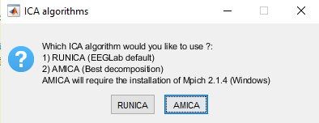

This first two prompts ask you, first, if you want to compute the independent component analysis (ICA; you should say no if the ICA decomposition has already been done on your files) and, if yes, in the second prompt you can decide which ICA algorithm to use (AMICA is recommanded since it is the [best performing algorithm](https://journals.plos.org/plosone/article?id=10.1371/journal.pone.0030135))


### 2.2 MPICH2


If you selected AMICA as the ICA algorithm and it is the first time you are running it, the script will download and run the installation of the [MPICH2 software](https://www.mpich.org/) (required to run AMICA). In case the download and/or the installation, follow these links: \
[64-bits Windows machines](http://www.mpich.org/static/downloads/1.4/mpich2-1.4-win-x86-64.msi)
[32-bits Windows machines](http://www.mpich.org/static/downloads/1.4/mpich2-1.4-win-ia32.msi)


### 2.3 Loading and Saving Data
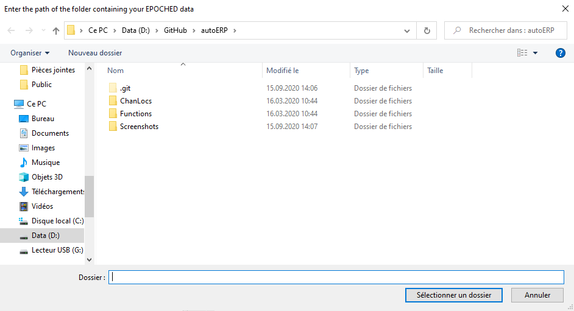

Indicate the most upper folder containing all your **epoched data**. 

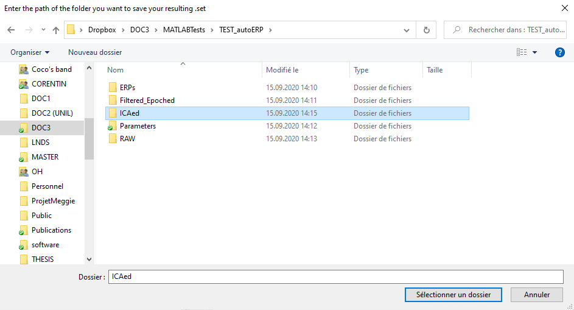

Indicate where to save your data files i) containing the ICA decomposition matrices and ii) the ones for which you will have rejected specific components.  


### 2.4 Suffixes

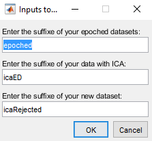

Related to the previous prompt, you will have to determine suffixes for each file type to be imported/exported: \
```
1) Enter the suffixe of the epoched data files that you want to load.
2) Enter the suffixe of the data already containing the ICA decomposition matrix OR the suffixe that will used to save your future ICA decomposition matrix-containing files.
3) Enter the suffixe of the data files that will be exported after the rejection of specific components.
```

### 2.5 Folders to Include

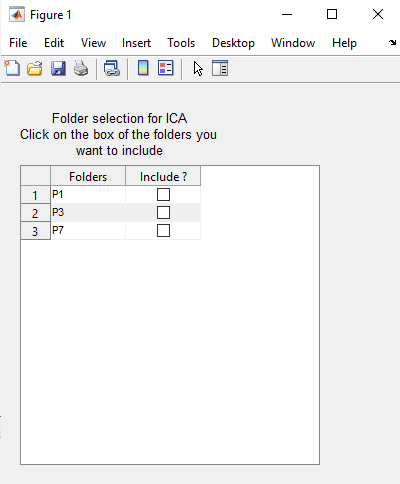

Select the folders on which you would like to apply ICA decomposition and/or reject specific ICA components. 


### 2.6 ICA Computation


If you see these outputs in MATLAB's Command Window it means that the ICA decomposition is ongoing.


### 2.7 ICA Rejection
#### 2.7.1 All Components


These 3 displays indicate the results of the ICLabel classifier for all the components (here 1-63 components). You can click on the number of any of these components to have a closer look at its decomposition (*see* [Chapter 2.7.2](#272-single-component)). \
In the middle, you will find a table in which you can report which components should be rejected. There is already a pre-selection based on the classifier (i.e. all components which are not labelled ```Brain``` are de facto pre-selected). You can press the ```Clear``` button if you prefer to define the list manually. 

**Once you are done, press on the cross X on the top-right corner and the code will resume**.

#### 2.7.2 Single Component


Once you click on any component number a display like this will pop-up. \
It is based on the display from the ICLabel plugin, specifically you find:
```
1) The topography of the component and i) the total variance accounted for by the component (here component number 5) and ii) the results of the classifier on the right. [top left]
2) The component activity over time (in ms) [top right].
3) A full representation of the component activity over time using color codes (e.g. useful for detecting eyes or cardiac artifacts) [bottom left].
4) The localization of the dipole(s) of the component in the brain space with the residual variance (RV; i.e. localization accuracy, should be < 15%) [bottom middle].
5) The power spectrum of the component activity [bottom right].
```

#### 2.7.3 Visualization of Result

*ASR Visualization scheme*


Here you have the possibility to visualize the changes that will occur to the EEG file activity if you decide to reject the components that you selected. \
```
- Press E to remove the epochs segmentation.
- Press O to only see the "old" EEG file (before IC rejection).
- Press N to only see the "new" EEG file (after IC rejection).
- Press B to see both EEG files superimposed.
```

*EEGLAB Visualization scheme*
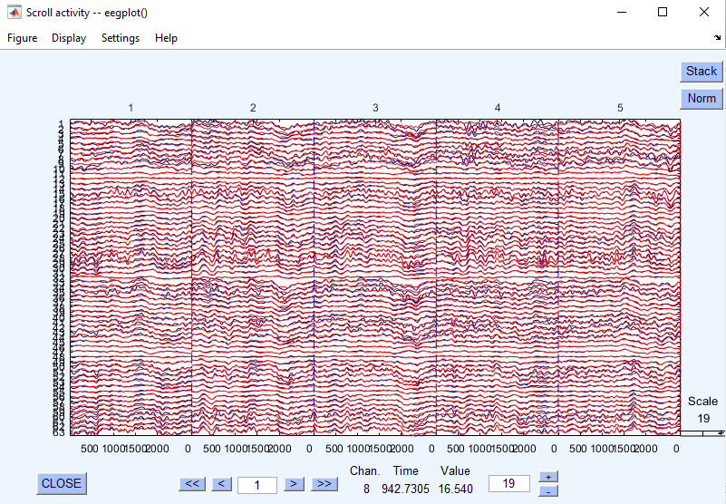

This EEGLAB built-in activity visualization will pop-up if the script cannot use ASR Visualization scheme (*known to be instable*).

*Closing Visualization*
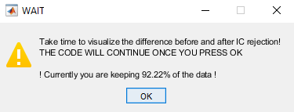

This prompt enables you to close all figures when you are done and also provides you with an indication regarding the amount of the original EEG data that will be preserved after IC rejection.

**⚠️ DO NOT CLOSE THIS TABLE BEFORE YOU ARE FINISHED VISUALIZING THE CURRENT FILE ⚠️.**

#### 2.7.4 Confirm Rejection

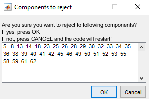

Finally, this is a last recall/warning before you actually apply the IC rejection. \
If you press on ```Cancel``` or you close the window, the script will re-run the steps in [Chapter 2.7](#27-ica-rejection) until you are satisfied with you results.

Once you are satisfied, press on ```OK```.


### 2.8 Log File

Similar to the other scripts a ICAlog_*date*.txt will be generated and will contain a summary of the ICA decomposition and/or rejection parameters and results.


## 3 ERPs.m

Now that you have filtered and epoched your data, your can pre-process the signal a tad bit more with interpolation and artefacts ejection before computing their Event-Related Potentials (ERPs) referenced either to Cz or average referenced. See the [README.md](README.md) for more details.

The averaging process of ERPs is compatible with all designs as long as you have a coherent nomenclature to support it. \
It means that the conditions' name need to be written in the same way somewhere on all files' name or in a sub-folder.


### 3.1 Settings

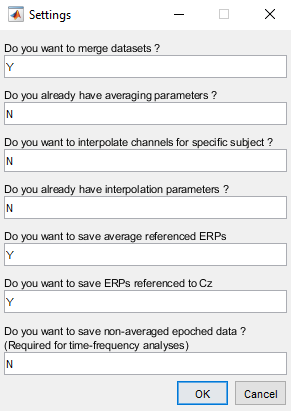

In this first prompt, you will tell the script what you want to do.

First, do you want to merge datasets ? In the case you have several files for a same subject in a same condition, you can say 'Y' to have all the same-subject and same-condition files to be loaded and merged together into one whole file. It can be useful if you stoped your recording and saved two separated files during your experiment for example. \
**The merging will load all files having the same condition name contained within one sub-folder.** \
The specification of the conditions will be done in [section 3.5](#35-erps-parameters). If you don't specify conditions then, the merging will just load everything in each sub-folders.

On the first run, you should not have averaging parameters. This is a system akin to the [epoching parameters](#16-epoching-parameters).

Possibly, you will want to interpolate bad channels. If 'Y', the provided bad channels will be ignored for the artefacts rejection phase and then interpolated using multi-quadratic interpolation. The link to this interpolation algorithm can be found in the Dependencies section of the [README.md](README.md).

If you specify already having *Interpolation parameters*, the script will ask you for the *to_interpolate.csv* file created at the end of the epoching process. In this file, you will find one row for each subject for each condition. You need to indicate their bad channels by putting the corresponding channel numbers in the next columns in the same fashion as the first example line. \ 
**Do not delete the first example line !** \ 
If you indicate not having any *Interpolation parameters* but still ask to interpolate, a table where you need to tick all the bad channels will be displayed (very slow and tedious; we do not recommend this method).

The next two lines ask if you want your ERPs referenced to Cz and/or perform average referencing at the end. 

The last line ask you if you want to save the signal just before the averaging. In this case, you will have epoched data pre-processed including artefacts rejection and interpolation, but not averaged into ERPs.


### 3.2 Parameters

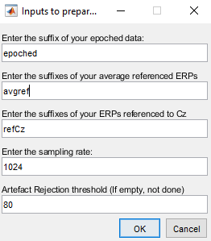

In this prompt, the script asks you for the suffix of your epoched data to know which files to load, akin to what is done in the filtering_epoching.m script's [second prompt](#12-parameters). It also asks you which suffix you want to add to the final ERP files to be exported.

The artefact rejection refers to a method in which all epochs containing one frame over the input threshold (80uV by default) will be excluded. \
If you don't want to use this method, erase the line's value.


### 3.3 Files path

1) The script will then ask you to select the folder containing all the epoched data you want to load. **It does not matter if this folder contains sub-folders. ** \
It will take that into account and copy the folder-tree structure when saving the final ERP files.
It will search for the files finishing by what you input in the first line of the [parameters prompt](#32-parameters).

2) Enter the folder where you want you filtered and epoched file to be saved.
These files will have the same names than your loaded epoched files, but with the suffix you input during the [parameters prompt](#32-parameters). \ 
The folder-tree will be rearranged to follow a classification by condition and event averaging.


### 3.4 Subject specific analyses

Same as [section 1.5](#15-subject-specific-analyses).


### 3.5 ERPs parameters

The script will first ask you for the marker_parameters.mat file that have been saved during your first epoching run (see [section 1.6](#16-epoching-parameters)) to show you again the table of the triggers' name you used during epoching. It is purely there to help you recall which names you gave to your triggers. \ 
You can skip this help by closing the window.

**_For each of the following prompt, close the window to continue._**

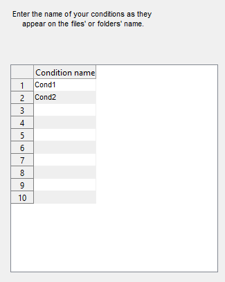

Same logic as in the [epoching parameters](#16-epoching-parameters): write the condition names you used in your nomenclature in each line of this prompt.
If you don't have conditions in your design, **delete the default cells' value.**

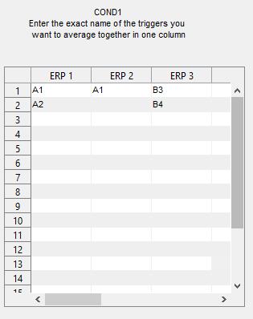

For each condition you specified, a prompt will appear for you to design your ERPs' averaging parameters.

Each non-empty column corresponds to the average of all specified triggers in the column for this condition. In the example of this screenshot, I will have three different ERPs for my condition COND1: one will be the average of the A1 and A2 triggers together, one the average of the A1 triggers only, one the average of the B3 and B4 triggers together.

After these, you will have to choose where you want the parameters to be saved (default name: "Averaging_parameters.mat"). \
It will allow you to load these averaging parameters the next time you run the script on the same dataset by saying 'Y' during the [settings prompt](#31-settings).

Next it will ask you to indicate the path of the to_interpolate.csv file or to determine the bad channels in a table based on your [settings](#31-settings).


### 3.6 Output files

That's it ! Your epoched data have been pre-processed including the interpolation of bad channels, artefacts rejection, rejection of epochs containing jumps of more than 30uV from one time-frame to another, averaging into ERPs, and re-referencing.

The ERPs are saved into folders per condition, and sub-folders per ERP's type.

A log.txt file is exported and saved with the ERPs to explain everything every steps of the preprocessing applied on your data.

A Ntrials.xlsx file is written, containing all the numbers of rejected epochs for each file (see screenshot bellow).


Each line corresponds to an ERP. The columns represent:

1) The file's name and path.

2) The initial number of epochs.

3) The number of epochs rejected during the artefacts rejection.

4) The percentage of epochs rejected during the artefacts rejection.

5) The number of epochs rejected because of a 30uV jumps from one time-frame to another.

6) The percentage of epochs rejected because of a 30uV jumps from one time-frame to another.

7) The final number of epochs within the ERP.

### 3.7 Advice for interpolation

It is adviced that you do not give bad channels to interpolate during your first run of ERPs computation.

After you have a first set of uninterpolated ERPs, you can see the quality of the signal with the percentages of epochs rejected during artefact rejection. It will give you a good indicator of which file may require channels interpolation. \ 
The uninterpolated ERPs in themselves are also a good visual indicator of which files need attention.

After having done this first run, you can adjust the to_interpolate.csv file and re-run the ERPs.m script easily by providing the script with the averaging and interpolation parameters.
